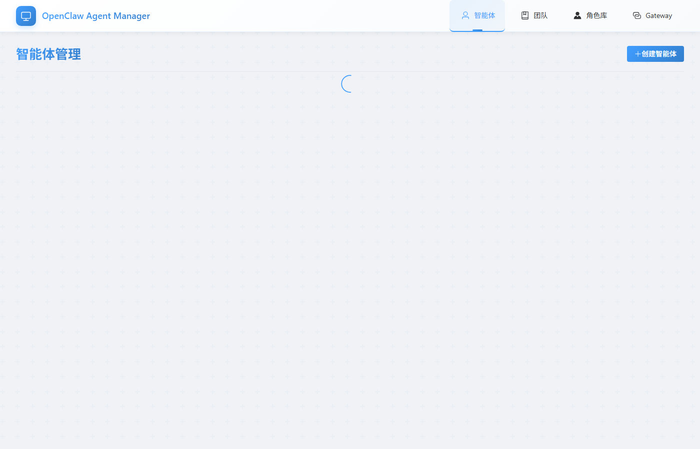
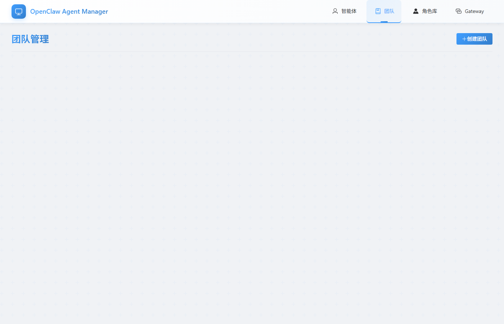
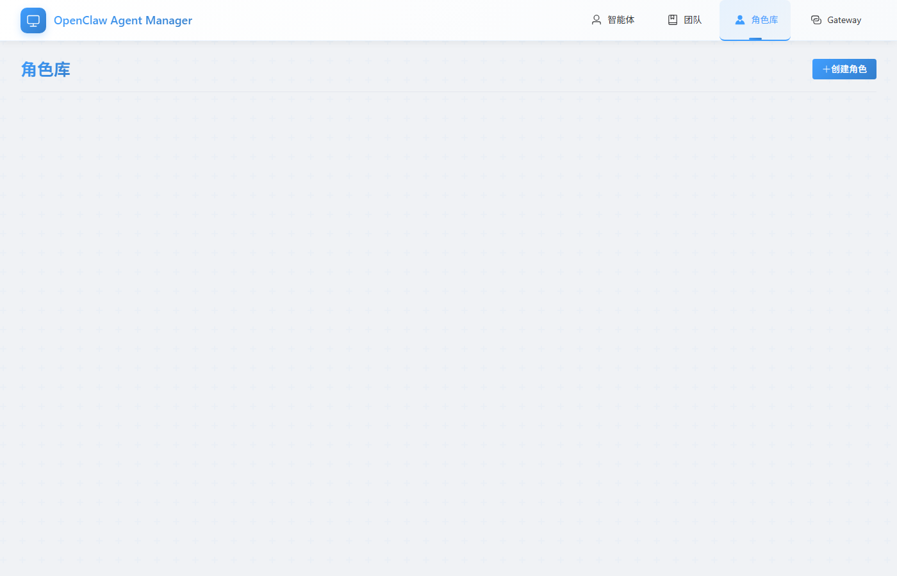
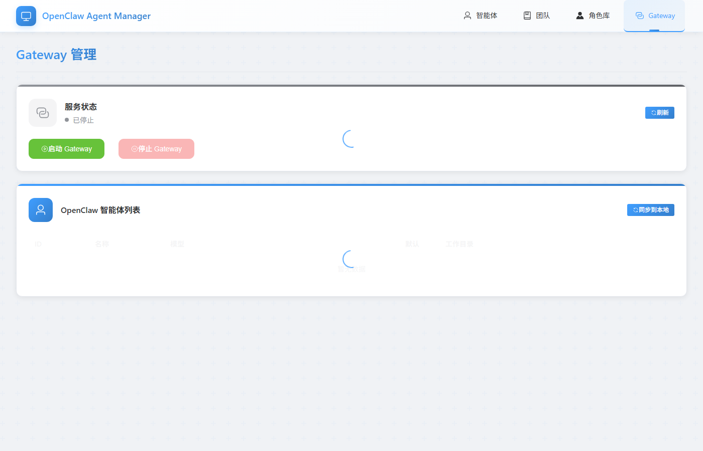

# OpenClaw Multi-Agent Manager

<div align="center">


**OpenClaw 多智能体可视化管理平台**

支持智能体的创建、配置、启停、协作和通信管理

[功能特性](#功能特性) • [快速开始](#快速开始) • [技术架构](#技术架构) • [截图展示](#截图展示)

</div>

---

## 目录

- [项目简介](#项目简介)
- [功能特性](#功能特性)
- [技术架构](#技术架构)
- [快速开始](#快速开始)
- [操作流程](#操作流程)
- [截图展示](#截图展示)
- [API 接口](#api-接口)
- [项目结构](#项目结构)
- [预置角色](#预置角色)
- [开发指南](#开发指南)
- [License](#license)

---

## 项目简介

OpenClaw Multi-Agent Manager 是一个为 OpenClaw 多智能体系统设计的可视化管理平台。采用前后端分离架构，提供友好的 Web UI 来管理智能体的全生命周期，包括创建、配置、启停、团队协作等功能。

### 核心价值

- **可视化操作** - 无需命令行，通过 Web UI 即可完成所有管理操作
- **团队协作** - 支持创建智能体团队，实现多智能体协同工作
- **角色模板** - 预置多种角色模板，快速创建不同职责的智能体
- **实时通信** - 内置消息功能，可直接与智能体交互

---

## 功能特性

### 智能体管理
- 创建、编辑、删除智能体（自动同步到 OpenClaw）
- 启动/停止智能体实例
- 从 OpenClaw 同步智能体列表
- 向智能体发送消息并查看响应

### Gateway 管理
- 实时查看 Gateway 运行状态
- 一键启动/停止 Gateway 服务
- 查看当前注册的 OpenClaw 智能体

### 团队协作
- 创建智能体团队，定义协作模式
- 一键部署/清理团队
- 可视化团队拓扑结构
- 团队成员角色分配

### 角色库
- 6 个预置角色模板（大总管、开发、内容、运营、法务、财务）
- 支持自定义角色创建
- 按分类浏览和管理角色

---

## 技术架构

### 整体架构

```
┌─────────────────────────────────────────────────────────────┐
│                        Frontend (Vue 3)                      │
│  ┌─────────┐ ┌─────────┐ ┌─────────┐ ┌─────────┐ ┌────────┐│
│  │ Agents  │ │ Teams   │ │ Roles   │ │ Gateway │ │ Message││
│  │  View   │ │  View   │ │  View   │ │  View   │ │  Panel ││
│  └────┬────┘ └────┬────┘ └────┬────┘ └────┬────┘ └───┬────┘│
│       │           │           │           │            │     │
│       └───────────┴───────────┴───────────┴────────────┘     │
│                           │                                  │
│                    Axios HTTP Client                         │
└───────────────────────────┼─────────────────────────────────┘
                            │ HTTP API (Port 3789)
                            ▼
┌─────────────────────────────────────────────────────────────┐
│                     Backend (FastAPI)                        │
│  ┌──────────────────────────────────────────────────────┐   │
│  │                    API Layer                          │   │
│  │  agents.py │ teams.py │ roles.py │ gateway.py        │   │
│  └─────────────────────┬────────────────────────────────┘   │
│                        │                                     │
│  ┌─────────────────────┴────────────────────────────────┐   │
│  │                  Service Layer                        │   │
│  │              OpenClawService (CLI Wrapper)            │   │
│  └─────────────────────┬────────────────────────────────┘   │
│                        │                                     │
│  ┌─────────────────────┴────────────────────────────────┐   │
│  │              Data Layer (SQLite + SQLAlchemy)         │   │
│  └──────────────────────────────────────────────────────┘   │
└───────────────────────────┼─────────────────────────────────┘
                            │ subprocess
                            ▼
┌─────────────────────────────────────────────────────────────┐
│                   OpenClaw CLI (Local)                       │
│   openclaw agents │ openclaw gateway │ openclaw agent       │
└─────────────────────────────────────────────────────────────┘
```

### 技术栈详情

#### 后端技术
| 技术 | 用途 |
|------|------|
| **FastAPI** | 高性能异步 Web 框架，提供 RESTful API |
| **SQLite** + **SQLAlchemy** | 轻量级数据库存储，ORM 映射 |
| **Pydantic** | 数据验证与序列化 |
| **uv** | 现代 Python 包管理工具 |
| **asyncio** | 异步 subprocess 调用 OpenClaw CLI |

#### 前端技术
| 技术 | 用途 |
|------|------|
| **Vue 3** | 渐进式 JavaScript 框架 |
| **TypeScript** | 类型安全的 JavaScript 超集 |
| **Vite** | 下一代前端构建工具 |
| **Element Plus** | Vue 3 UI 组件库 |
| **Pinia** | Vue 3 状态管理 |
| **Axios** | HTTP 客户端 |

### 核心设计模式

**OpenClawService 封装模式**：所有与 OpenClaw 的交互都通过 `OpenClawService` 类完成，使用 `asyncio.create_subprocess_exec` 异步执行 CLI 命令，确保非阻塞操作。

```python
# 核心调用示例
async def list_agents(self) -> list[dict]:
    process = await asyncio.create_subprocess_exec(
        "openclaw", "agents", "list", "--json",
        stdout=asyncio.subprocess.PIPE,
        stderr=asyncio.subprocess.PIPE
    )
    # ... 处理结果
```

---

## 快速开始

### 前置要求

| 依赖 | 版本要求 | 安装方式 |
|------|----------|----------|
| Python | 3.10+ | [官网下载](https://www.python.org/downloads/) |
| Node.js | 18+ | [官网下载](https://nodejs.org/) |
| uv | latest | `pip install uv` |
| OpenClaw CLI | latest | `npm install -g openclaw` |

### 验证 OpenClaw 安装

```bash
# 检查版本
openclaw --version

# 测试命令
openclaw agents list --json
```

### 一键启动

**Windows:**
```bash
start.bat
```

**Linux/Mac:**
```bash
chmod +x start.sh stop.sh
./start.sh
```

启动后访问：
- 前端界面: http://localhost:5173
- 后端 API: http://localhost:3789
- API 文档: http://localhost:3789/docs

### 手动启动

**后端:**
```bash
cd backend
uv sync                                    # 安装依赖
uv run uvicorn src.main:app --reload --port 3789
```

**前端:**
```bash
cd frontend
npm install                                # 安装依赖
npm run dev                                # 启动开发服务器
```

---

## 操作流程

### 智能体管理流程

```
┌──────────────┐     ┌──────────────┐     ┌──────────────┐
│  创建智能体   │────▶│  配置角色    │────▶│  启动智能体   │
└──────────────┘     └──────────────┘     └──────────────┘
                                               │
                                               ▼
                    ┌──────────────────────────────────────┐
                    │  智能体就绪，可接收消息和任务指令      │
                    └──────────────────────────────────────┘
```

### 团队协作流程

```
┌──────────────┐     ┌──────────────┐     ┌──────────────┐
│  创建团队     │────▶│  添加成员    │────▶│  部署团队     │
└──────────────┘     └──────────────┘     └──────────────┘
                                               │
                                               ▼
                    ┌──────────────────────────────────────┐
                    │  团队协作运行，智能体间自动协调        │
                    └──────────────────────────────────────┘
```

### 端口说明

| 服务 | 端口 | 说明 |
|------|------|------|
| Frontend | 5173 | Vue 开发服务器 |
| Backend API | 3789 | FastAPI 服务 |
| OpenClaw Gateway | 18789 | OpenClaw 网关服务 |

---

## 截图展示

### 仪表盘


系统仪表盘，展示智能体统计、团队概览和 Gateway 状态。

### 智能体管理



智能体列表页面，支持创建、编辑、删除、启停智能体，并可发送消息测试。

### 团队协作



团队管理页面，可视化展示团队成员拓扑结构，支持一键部署和清理。

### 角色库



角色模板库，预置 6 种常用角色，支持自定义扩展。

### Gateway 管理



Gateway 状态监控，管理 OpenClaw 网关服务启停。

---

## API 接口

### 智能体

| 方法 | 路径 | 说明 |
|------|------|------|
| `GET` | `/api/agents` | 获取所有智能体 |
| `GET` | `/api/agents/sync` | 从 OpenClaw 同步智能体 |
| `POST` | `/api/agents` | 创建智能体 |
| `PUT` | `/api/agents/{id}` | 更新智能体 |
| `DELETE` | `/api/agents/{id}` | 删除智能体 |
| `POST` | `/api/agents/{id}/start` | 启动智能体 |
| `POST` | `/api/agents/{id}/stop` | 停止智能体 |
| `POST` | `/api/agents/{id}/message` | 发送消息 |

### Gateway

| 方法 | 路径 | 说明 |
|------|------|------|
| `GET` | `/api/gateway/status` | 获取 Gateway 状态 |
| `POST` | `/api/gateway/start` | 启动 Gateway |
| `POST` | `/api/gateway/stop` | 停止 Gateway |
| `GET` | `/api/gateway/agents` | 获取 OpenClaw 智能体列表 |

### 团队

| 方法 | 路径 | 说明 |
|------|------|------|
| `GET` | `/api/teams` | 获取所有团队 |
| `POST` | `/api/teams` | 创建团队 |
| `DELETE` | `/api/teams/{id}` | 删除团队 |
| `POST` | `/api/teams/{id}/deploy` | 部署团队 |
| `POST` | `/api/teams/{id}/teardown` | 清理团队 |

### 角色

| 方法 | 路径 | 说明 |
|------|------|------|
| `GET` | `/api/roles` | 获取所有角色 |
| `GET` | `/api/roles/categories` | 获取角色分类 |
| `POST` | `/api/roles` | 创建角色 |
| `DELETE` | `/api/roles/{id}` | 删除角色 |

---

## 项目结构

```
openclaw-agent-manager/
├── backend/                    # Python 后端
│   ├── src/
│   │   ├── api/                # API 路由层
│   │   │   ├── agents.py       # 智能体 API
│   │   │   ├── teams.py        # 团队 API
│   │   │   ├── roles.py        # 角色 API
│   │   │   └── gateway.py      # Gateway API
│   │   ├── models/             # SQLAlchemy 数据模型
│   │   ├── schemas/            # Pydantic 请求/响应模型
│   │   └── services/
│   │       └── openclaw_service.py  # OpenClaw CLI 封装
│   ├── data/                   # SQLite 数据库目录
│   ├── pyproject.toml          # 项目依赖配置
│   └── uv.lock                 # 依赖锁定文件
│
├── frontend/                   # Vue 3 前端
│   ├── src/
│   │   ├── api/                # Axios API 客户端
│   │   ├── views/              # 页面组件
│   │   │   ├── AgentsView.vue
│   │   │   ├── TeamsView.vue
│   │   │   ├── RolesView.vue
│   │   │   └── GatewayView.vue
│   │   ├── stores/             # Pinia 状态管理
│   │   ├── components/         # 可复用组件
│   │   │   └── TopologyGraph.vue  # 团队拓扑图
│   │   └── types/              # TypeScript 类型定义
│   ├── package.json
│   └── vite.config.ts
│
├── docs/                       # 文档目录
│   └── screenshots/            # 截图展示
│
├── start.bat                   # Windows 启动脚本
├── start.sh                    # Linux/Mac 启动脚本
├── stop.bat                    # Windows 停止脚本
├── stop.sh                     # Linux/Mac 停止脚本
├── CLAUDE.md                   # Claude Code 开发指南
└── README.md                   # 本文件
```

---

## 预置角色

| 角色 | 中文名 | Emoji | 职责描述 |
|------|--------|-------|----------|
| steward | 大总管 | 🎯 | 任务分发与协调，团队管理中枢 |
| dev | 开发助理 | 💻 | 代码开发、架构设计、DevOps |
| content | 内容助理 | ✍️ | 文案撰写、内容策划、创意输出 |
| ops | 运营助理 | 📈 | 增长策略、数据分析、活动策划 |
| law | 法务助理 | ⚖️ | 合同审核、合规检查、风险管理 |
| finance | 财务助理 | 💰 | 记账核算、预算管理、财务分析 |

---

## 开发指南

### 环境变量配置

后端 `.env` 文件（可选）：

```env
API_HOST=127.0.0.1
API_PORT=3789
DATABASE_URL=sqlite+aiosqlite:///./data/agents.db
OPENCLAW_WORKSPACE=./workspace
```

### 开发命令

```bash
# 后端开发
cd backend
uv run uvicorn src.main:app --reload --port 3789   # 启动开发服务器
uv run pytest                                        # 运行测试
uv run ruff check src                                # 代码检查

# 前端开发
cd frontend
npm run dev                                          # 启动开发服务器
npm run build                                        # 生产构建
npm run preview                                      # 预览生产构建
```

### OpenClaw CLI 命令对照

| 功能 | CLI 命令 |
|------|----------|
| 列出智能体 | `openclaw agents list --json` |
| 创建智能体 | `openclaw agents add <name> --workspace <dir>` |
| 删除智能体 | `openclaw agents delete <id> --force` |
| Gateway 状态 | `openclaw gateway status --json` |
| 启动 Gateway | `openclaw gateway start` |
| 停止 Gateway | `openclaw gateway stop` |
| 发送消息 | `openclaw agent --agent <id> --message <text>` |

---

## License

[MIT](LICENSE)

---

<div align="center">

**OpenClaw Multi-Agent Manager** © 2024 - Present

</div>
